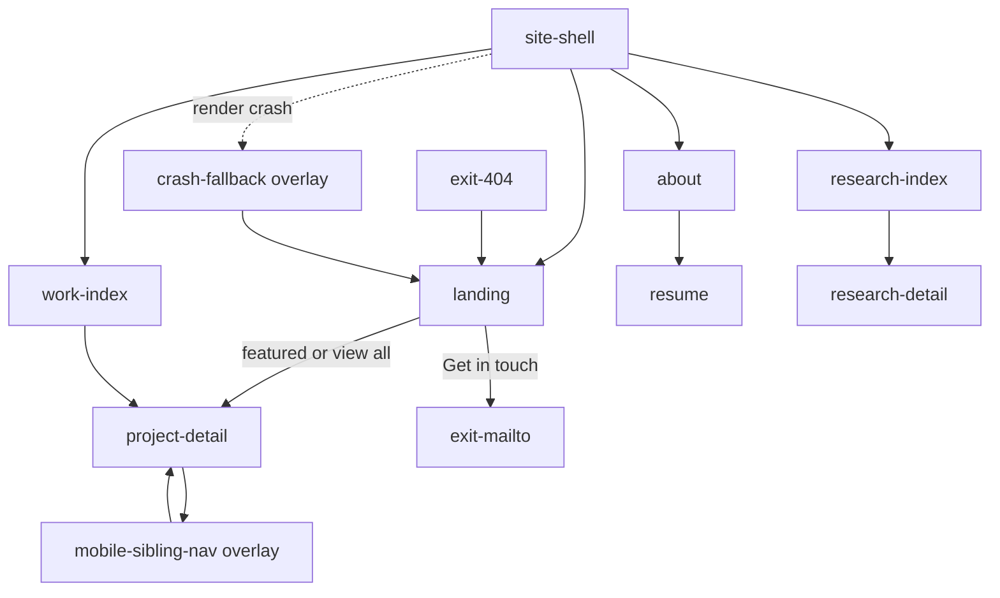

# UX Map — darce.xyz

> Inventory for `map_ref: darce-xyz`
> Source: `docs/ux-maps/darce-xyz.uxmap.json`
> `code_ref` paths are relative to the **darce.github.io** repo root.
> Purpose of this map: give the ADLC colour / hierarchy transplant a screen-and-zone checklist. Fonts stay GeistMono + Roboto Flex. Accents stay coral `#d9253f` and royal blue (`#3c00f7` light / `#6ab5db` dark).

## Jobs

| Job | Primary screens |
| --- | --- |
| Decide whether Daniel is the right hire | Home → featured case or mailto |
| Scan work / open a case | `/work` → `/projects/:slug` |
| Scan research / open an exhibit | `/research` → `/research/:slug` |
| Read biography | `/about` |
| Read credentials | `/resume` (not in primary nav) |
| Start an email | Home CTA → mailto |
| Switch light / dark | Theme toggle on every page |
| Recover from a dead URL | 404 → home / about / research |

## Screens

| id | kind | route | code_ref |
| --- | --- | --- | --- |
| site-shell | screen | `*` | `components/layout/Layout.tsx` |
| landing | screen | `/` | `pages/index.tsx` |
| work-index | screen | `/work` | `pages/work.tsx` |
| research-index | screen | `/research` | `pages/research/index.tsx` |
| project-detail | screen | `/projects/:slug` | `pages/[section]/[slug].tsx` |
| research-detail | screen | `/research/:slug` | `pages/[section]/[slug].tsx` |
| about | screen | `/about` | `pages/about.tsx` |
| resume | screen | `/resume` | `pages/resume.tsx` |
| privacy | screen | `/privacy` | `pages/privacy.tsx` |
| mobile-sibling-nav | overlay | detail pages | `components/features/SectionView/SectionView.tsx` |
| crash-fallback | overlay | `*` | `components/common/ErrorBoundary.tsx` |
| exit-404 | exit | `/404` | `pages/404.tsx` |
| exit-mailto | exit | `mailto:…` | `pages/index.tsx` |
| exit-altcontext | exit | `https://altcontext.com` | `pages/index.tsx` |

IA: fully-connected primary nav (home / work / research / about) plus pyramid hubs at `/work` and `/research`. Resume and privacy are deep-linked, not nav items. Footer.tsx is unused.

## ASCII — chrome + home (colour-critical)

```
+------------------------------------------------------------------+
| SKIP (focus only)                                                |
+----------------------------------------------+-------------------+
| MASTHEAD  title (header)  subtitle (text)    | CUBE (border)     |
| band = masthead                              | decorative        |
+----------------------------------------------+-------------------+
| nav: home  work  research  about   [2x2 toggle: surface/text/    |
|      selected=surface  hover=border         link/border]         |
| breadcrumb (detail only):  <-  title  ->                         |
+------------------------------------------------------------------+
| CANVAS  backgroundColor                                          |
|                                                                  |
|  (headshot)   positioning (text)                                 |
|               inline link = ultramarine/sky → coral hover        |
|               [ Get in touch ]  DitheredCard                     |
|                                                                  |
|  Selected work                                                   |
|   [ case ] [ case ] [ case ]   surface / text / border hover     |
|   View all projects →                                            |
+------------------------------------------------------------------+
states: default | dark | focus_keyboard | reduced_motion
```

## ASCII — work / research hub

```
+------------------------------------------------------------------+
| chrome as above                                                  |
+------------------------------------------------------------------+
|  [img or inactiveBg]   [img]   [img]                             |
|  title (text)          title   title                             |
|  subtitle              sub     sub                               |
|  dithered card; hover border = coral                             |
+------------------------------------------------------------------+
states: default | empty ("No content found") | dark
```

## ASCII — detail (pyramid item)

```
+----------------------+-------------------------------------------+
| MENU (inactiveBg)    | ARTICLE                                   |
| selected = surface   | title (text)                              |
| hover = link / coral | optional photo masthead                   |
|                      | external link (unclassed) + details       |
|                      | figures + MDX (text, unclassed links)     |
|                      | hairline divider                          |
+----------------------+-------------------------------------------+
| overlay (mobile): [ <- Previous ] [ Next -> ]  DitheredCards     |
+------------------------------------------------------------------+
swipe between siblings; keyboard/cards are the A11Y-15 alternative
```

## Mermaid — primary flows



## Colour change — zone checklist

Proof on real grounds ([COL-02][COL-12][COL-16][A11Y-01]), not equal chips:

| Zone | Tokens / leaks | Must still do after retint |
| --- | --- | --- |
| z-page-canvas | `backgroundColor` **and** `global.scss` body / Radix `--color-background` | Cool paper `#e7eaef` / terminal `#1c1d21` |
| z-masthead | `masthead`, `header`, `text` | Value step vs page; optional terminal band |
| z-primary-nav | `link`, `surface`, `border`, `text` | No accent fill; place via weight + selected surface |
| z-theme-toggle | `surface` `text` `link` `border` | 2×2 remains a live legend of the four identity chips |
| z-hero-cta / cards / prev-next | DitheredCard: `surface` + `border` hover | Coral stays the only hover accent |
| z-hero-positioning / MDX / about | unclassed `a` hex in `global.scss` | Ultramarine / sky → coral; AA on new grounds |
| z-work-grid / figures / headshots | photos | Accents still read on image, not only paper |
| z-research-mdx OrderBook | Radix `--green/--red/--gray` | Do **not** fold bid/ask into site accents ([A11Y-06][VIZ]) |
| z-cube | `border` | Coral faces on both masthead grounds |

Keep: coral `#d9253f`, ultramarine `#3c00f7`, sky `#6ab5db`.
Borrow from ADLC: paper / raised / sunk / ink / ink-2 / ink-3 / terminal. Do not import ADLC green / yellow onto the marketing surface ([COL-09]).

## Critique (advisory)

| Sev | ID | Finding |
| --- | --- | --- |
| med | [RLSE-04] | Empty hubs have copy; 404 and crash exist. No offline/degraded state (static site — acceptable). Footer component exists but never mounts — chrome is incomplete relative to the file tree, not the live IA. |
| med | [NAV-11] | Static routes deep-link. Appearance is `localStorage`, not URL — theme is not shareable. Acceptable if treated as device preference, not place. |
| med | [LAY-10] | Radix `accentColor="cyan"` + `radius="medium"` is an unchosen second system leaking into exhibits. Colour pass should isolate or retune it. |
| low | [A11Y-15] | Swipe has visible prev/next cards. Good. |
| low | [COL-09] | Unclassed links + card hover + cube + toggle all use coral. Thrift still holds if coral is never a fill. |
| n/a | [HAI-01] | No AI-label surface except live OrderBook data — out of this colour map. |

## Suggested slices (from map)

1. **Token + leak pass** — `palettes.scss` + `global.scss` grounds + unclassed links + WCAG hex pins
2. **Masthead hierarchy** — decide terminal band vs sunk paper; proof `z-masthead` + cube on both
3. **Relational proof** — home, work grid, one photo case, about, resume, 404, both appearances, 320px
4. **Exhibit isolation** — OrderBook / Radix stay on their own encoding
5. **Toggle legend** — confirm 2×2 still reads as paper / ink / royal / coral after the retint

## Not doing (map-level)

- Font change
- ADLC pass/fail chips on the portfolio
- Recolouring bid/ask
- New nav items, footer, or card IA
- Canvas as SSOT
