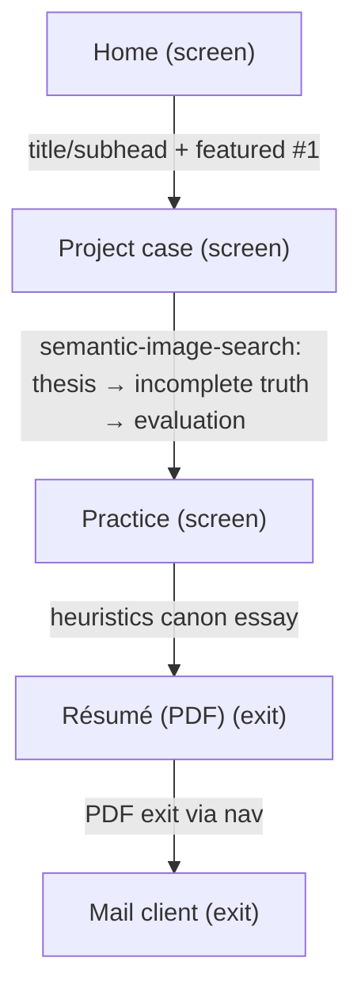
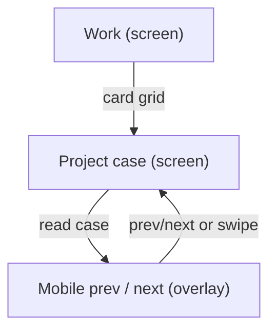
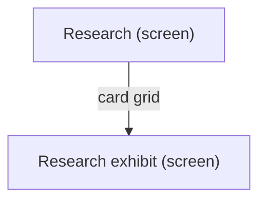
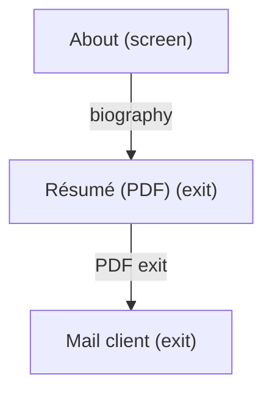
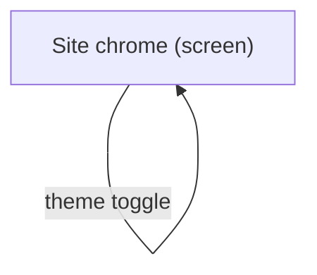
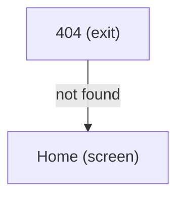
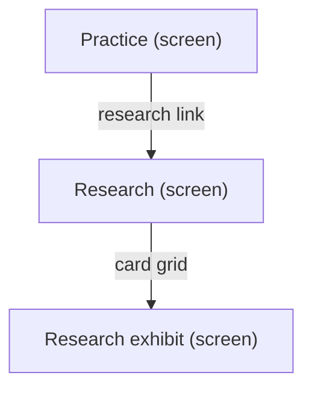

# UX Map — darce.xyz

> Inventory for `map_ref: darce-xyz` — repositioning revision (Product Designer & Design Technologist for AI and complex systems).
> Source: `docs/ux-maps/darce-xyz.uxmap.json`
> `code_ref` paths are relative to the **darce.github.io** repo root.
> Rendered with `workbay-canvas-mcp ux-map render --format markdown` (mcp-workbay-canvas). The CLI schema only accepts
> `default|loading|empty|error|offline|first_time|edge_input|degraded` states and no zone `notes`, so the render below is
> from a projection: `dark/focus_keyboard/reduced_motion→default`, `image_error→error`, `media_pending/partial_library→degraded`,
> `no_folder/no_matches→empty`, `model_unavailable/unavailable_volume→offline`, `experimental→edge_input`. The JSON keeps the
> site-native state names and per-zone token notes; read it for the full detail.
> Per-screen ASCII wireframes for the new surfaces live in `docs/ux-maps/darce-xyz-reposition-screens.md`.


**Product:** `darce.xyz`

## Goals
- Inventory every visitor surface before the ADLC colour / hierarchy transplant so token edits have a checklist, not invented IA
- Name jobs, screens, zones, states, and flows a hiring visitor actually walks
- Mark which palette tokens each zone already consumes so light/dark proof is relational, not a swatch strip
- Model the repositioning to 'Product Designer & Design Technologist for AI and complex systems': new nav, new /practice hub, semantic-image-search case first, résumé as PDF exit

## Jobs
- `job-evaluate-hire` — Decide whether Daniel is the right hire
- `job-assess-design-judgment` — Check design rationale and judgment (recruiter / design lead)
- `job-browse-work` — Scan work and open a case study
- `job-browse-research` — Scan research and open an exhibit
- `job-read-about` — Read biography and positioning
- `job-read-resume` — Read credentials
- `job-contact` — Start an email
- `job-toggle-appearance` — Switch light / dark
- `job-recover-404` — Recover from a dead URL

## Screens
| id | kind | route | title |
| --- | --- | --- | --- |
| `site-shell` | screen | `*` | Site chrome |
| `landing` | screen | `/` | Home |
| `work-index` | screen | `/work` | Work |
| `research-index` | screen | `/research` | Research |
| `project-detail` | screen | `/projects/:slug` | Project case |
| `research-detail` | screen | `/research/:slug` | Research exhibit |
| `practice` | screen | `/practice` | Practice |
| `about` | screen | `/about` | About |
| `resume` | exit | `/resume/` | Résumé (PDF) |
| `privacy` | screen | `/privacy` | Privacy |
| `mobile-sibling-nav` | overlay | `/projects/:slug \| /research/:slug` | Mobile prev / next |
| `crash-fallback` | overlay | `*` | Error boundary |
| `exit-404` | exit | `/404` | 404 |
| `exit-mailto` | exit | `mailto:daniel.arce@gmail.com` | Mail client |

### Site chrome (`site-shell`)

```
+------------------------------------------------------------+
| Site chrome  [screen]  *                                   |
| Fully-connected escape hatch on every page: skip link, ma… |
+------------------------------------------------------------+
| ZONES                                                      |
|   - Skip to main content (nav) states=[default]            |
|   - Masthead wordmark + subtitle → home (nav) states=[def… |
|   - Decorative 3D cube (other) states=[default]            |
|   - Primary nav: home / work / practice / about / résumé … |
|   - 2×2 theme swatch (form) states=[default]               |
|   - Detail breadcrumb prev / title / next (nav) states=[d… |
|   - Page canvas + main landmark (content) states=[default] |
+------------------------------------------------------------+
| ACTIONS                                                    |
|   [secondary] Go home -> landing                           |
|   [PRIMARY] Open about -> about                            |
|   [PRIMARY] Open practice hub -> practice                  |
|   [PRIMARY] Open résumé (PDF) -> resume                    |
|   [PRIMARY] Open work hub -> work-index                    |
|   [secondary] Toggle light / dark -> appearance            |
+------------------------------------------------------------+
| states: default                                            |
+------------------------------------------------------------+
```

### Home (`landing`)

```
+------------------------------------------------------------+
| Home  [screen]  /                                          |
| Title + subhead ('Product Designer & Design Technologist … |
+------------------------------------------------------------+
| ZONES                                                      |
|   - Dithered headshot (content) states=[default]           |
|   - Title + subhead positioning (content) states=[default] |
|   - Get in touch (mailto DitheredCard) (job) states=[defa… |
|   - Selected work list (3 cases) (queue) states=[default]  |
|   - View all projects (nav) states=[default]               |
+------------------------------------------------------------+
| ACTIONS                                                    |
|   [PRIMARY] Get in touch -> exit-mailto                    |
|   [PRIMARY] Open semantic-image-search case -> project-de… |
+------------------------------------------------------------+
| states: default                                            |
+------------------------------------------------------------+
```

### Work (`work-index`)

```
+------------------------------------------------------------+
| Work  [screen]  /work                                      |
| Pyramid hub: equal-size project cards. Tufte small-multip… |
+------------------------------------------------------------+
| ZONES                                                      |
|   - Project card grid (queue) states=[default,empty]       |
+------------------------------------------------------------+
| ACTIONS                                                    |
|   [PRIMARY] Open project case -> project-detail            |
+------------------------------------------------------------+
| states: default | empty                                    |
+------------------------------------------------------------+
```

### Research (`research-index`)

```
+------------------------------------------------------------+
| Research  [screen]  /research                              |
| Same card grid as work, different section. Reached from /… |
+------------------------------------------------------------+
| ZONES                                                      |
|   - Research card grid (queue) states=[default,empty]      |
+------------------------------------------------------------+
| ACTIONS                                                    |
|   [PRIMARY] Open research exhibit -> research-detail       |
+------------------------------------------------------------+
| states: default | empty                                    |
+------------------------------------------------------------+
```

### Project case (`project-detail`)

```
+------------------------------------------------------------+
| Project case  [screen]  /projects/:slug                    |
| Read one case: sibling menu + article (title, optional ma… |
+------------------------------------------------------------+
| ZONES                                                      |
|   - Section sibling list (nav) states=[default]            |
|   - Case title (content) states=[default]                  |
|   - Optional hero figure (content) states=[default,empty]  |
|   - External link + details (content) states=[default,emp… |
|   - Inline figures (content) states=[default,error]        |
|   - MDX article body (content) states=[default]            |
|   - Article divider (replaces MDX hr) (other) states=[def… |
|   - SIS hero / thesis (content) states=[default,degraded]  |
|   - At-a-glance table (content) states=[default]           |
|   - Problem (content) states=[default]                     |
|   - Principles (content) states=[default]                  |
|   - Core journey strip (content) states=[default,degraded] |
|   - Designing for incomplete truth (state comparison) (co… |
|   - Data-rich exploration (content) states=[default,degra… |
|   - Evaluation: technical / expert / external-user gap (c… |
|   - Three 'evaluation changed the product' stories (conte… |
|   - Outcome & limits (content) states=[default]            |
+------------------------------------------------------------+
| ACTIONS                                                    |
|   [secondary] Open case external link -> external          |
+------------------------------------------------------------+
| states: default | empty | error | degraded                 |
+------------------------------------------------------------+
```

### Research exhibit (`research-detail`)

```
+------------------------------------------------------------+
| Research exhibit  [screen]  /research/:slug                |
| Same SectionView chrome as project-detail; MDX may mount … |
+------------------------------------------------------------+
| ZONES                                                      |
|   - Research sibling list (nav) states=[default]           |
|   - Research MDX + exhibits host (content) states=[defaul… |
+------------------------------------------------------------+
| ACTIONS                                                    |
|   [PRIMARY] Open research exhibit -> research-detail       |
+------------------------------------------------------------+
| states: default | empty | degraded                         |
+------------------------------------------------------------+
```

### Practice (`practice`)

```
+------------------------------------------------------------+
| Practice  [screen]  /practice                              |
| Hub for how judgment is made inspectable: the 'Heuristics… |
+------------------------------------------------------------+
| ZONES                                                      |
|   - Practice framing (title + one-paragraph thesis) (cont… |
|   - Heuristics Canon essay (content) states=[default]      |
|   - Link to research index (/research) (nav) states=[defa… |
|   - Get in touch / view work (job) states=[default]        |
+------------------------------------------------------------+
| ACTIONS                                                    |
|   [secondary] Open research index -> research-index        |
+------------------------------------------------------------+
| states: default                                            |
+------------------------------------------------------------+
```

### About (`about`)

```
+------------------------------------------------------------+
| About  [screen]  /about                                    |
| Headshot + MDX biography.                                  |
+------------------------------------------------------------+
| ZONES                                                      |
|   - About headshot (content) states=[default]              |
|   - About article (content) states=[default]               |
+------------------------------------------------------------+
| ACTIONS                                                    |
|   [PRIMARY] Open résumé (PDF) -> resume                    |
+------------------------------------------------------------+
| states: default                                            |
+------------------------------------------------------------+
```

### Résumé (PDF) (`resume`)

```
+------------------------------------------------------------+
| Résumé (PDF)  [exit]  /resume/                             |
| Serves the résumé as a direct PDF download. Now a primary… |
+------------------------------------------------------------+
| ZONES                                                      |
|   - PDF handoff (browser viewer / download) (other) state… |
+------------------------------------------------------------+
| ACTIONS                                                    |
|   [PRIMARY] Get in touch -> exit-mailto                    |
+------------------------------------------------------------+
| states: default                                            |
+------------------------------------------------------------+
```

### Privacy (`privacy`)

```
+------------------------------------------------------------+
| Privacy  [screen]  /privacy                                |
| Analytics disclosure. Linked from tests/footer copy; not … |
+------------------------------------------------------------+
| ZONES                                                      |
|   - Privacy policy copy (content) states=[default]         |
+------------------------------------------------------------+
| states: default                                            |
+------------------------------------------------------------+
```

### Mobile prev / next (`mobile-sibling-nav`)

```
+------------------------------------------------------------+
| Mobile prev / next  [overlay]  /projects/:slug | /researc… |
| Full-bleed DitheredCards under the article + swipe betwee… |
+------------------------------------------------------------+
| ZONES                                                      |
|   - Previous / next DitheredCards (nav) states=[default,e… |
+------------------------------------------------------------+
| ACTIONS                                                    |
|   [secondary] Next sibling -> project-detail               |
|   [secondary] Previous sibling -> project-detail           |
+------------------------------------------------------------+
| states: default | empty                                    |
+------------------------------------------------------------+
```

### Error boundary (`crash-fallback`)

```
+------------------------------------------------------------+
| Error boundary  [overlay]  *                               |
| Render-crash recovery with a home link.                    |
+------------------------------------------------------------+
| ZONES                                                      |
|   - Crash message + home link (status) states=[error]      |
+------------------------------------------------------------+
| ACTIONS                                                    |
|   [secondary] Go home -> landing                           |
+------------------------------------------------------------+
| states: error                                              |
+------------------------------------------------------------+
```

### 404 (`exit-404`)

```
+------------------------------------------------------------+
| 404  [exit]  /404                                          |
| Dead URL. Escape to home / about / research.               |
+------------------------------------------------------------+
| ZONES                                                      |
|   - Recovery links (nav) states=[error]                    |
+------------------------------------------------------------+
| ACTIONS                                                    |
|   [secondary] Go home -> landing                           |
+------------------------------------------------------------+
| states: error                                              |
+------------------------------------------------------------+
```

### Mail client (`exit-mailto`)

```
+------------------------------------------------------------+
| Mail client  [exit]  mailto:daniel.arce@gmail.com          |
| Leave the site to compose email.                           |
+------------------------------------------------------------+
| ZONES                                                      |
|   - OS mail client (other) states=[default]                |
+------------------------------------------------------------+
| states: default                                            |
+------------------------------------------------------------+
```

## Flows
### Land → featured case or contact (`flow-hire-eval`)

```mermaid
flowchart TD
  %% flow: Land → featured case or contact job=job-evaluate-hire
  n_site_shell["Site chrome (screen)"]
  n_landing["Home (screen)"]
  n_site_shell -->|chrome + canvas| n_landing
  n_project_detail["Project case (screen)"]
  n_landing -->|title/subhead + CTA + 3 cases (SIS first)| n_project_detail
  n_exit_mailto["Mail client (exit)"]
  n_project_detail -->|optional featured case| n_exit_mailto
```

### Land → SIS case → practice → résumé PDF → contact (`flow-hire-eval-designer`)



### Work hub → case → sibling (`flow-browse-work`)



### Research hub → exhibit (`flow-browse-research`)



### About → résumé PDF → contact (`flow-about-resume`)



### Any page → flip appearance (`flow-toggle-theme`)



### Dead URL → known page (`flow-404-recover`)



### Practice → research index → exhibit (`flow-practice-research`)



## Open questions
- Should the masthead band go terminal-dark (#1c1d21) on the light theme to match ADLC hierarchy, or stay a sunk-paper step so the wordmark stays ink-on-paper? ([COL-04][COL-12][IDNT-05])
- Radix Theme is appearance + accentColor cyan + radius medium — it leaks a second palette into OrderBook and any unstyled Radix surface. Freeze it, retune it, or isolate exhibits? ([COL-03][LAY-10])
- global.scss hardcodes parchment / #1a1a1a and $electric-ultramarine / $sky-blue / $coral-red outside t(). Token-only palette edit will desync body + unclassed links. ([UI-01][REF-10])
- Footer.tsx exists and is unused — is a site footer in scope for this colour pass, or still not-doing?
- 404 copy says 'Back to projects' but href is '/'. Fix in this pass or leave?
- SIS screenshots are not captured. Does the case ship with labelled 'screenshot pending' placeholders (designed media_pending state) or is publish gated on media? ([RLSE-04][LAY-10])
- Résumé nav item exits to a PDF with no site chrome. Should the nav item carry a PDF affordance (arrow/label) so the context change is not a surprise? ([A11Y-20][NAV-11])
- /research left the nav; only /practice links to it. Is one in-site path enough for the research job, or should about/work also link it?
- Practice essay cites canon rule IDs versionless — do those anchors resolve publicly, or are they internal-only references?

## Not doing
- Changing GeistMono / Roboto Flex (operator lock)
- Importing ADLC green / yellow / pass-fail chips onto the marketing surface (COL-09 thrift; keep coral + royal blue as the only accents)
- Recolouring OrderBook bid/ask Radix greens/reds as part of the site palette
- Pixel comps or freeform canvas as map SSOT
- Adding a site footer or resurrecting Footer.tsx unless separately scoped
- exit-altcontext: AltContext.com link removed from the home hero; no external current-work exit on landing
- Removing or redirecting /research/* routes (URLs stay live; only the nav entry is dropped)
- Capturing SIS screenshots inside this map slice (tracked as media_pending state, not blocked)

## ASCII — chrome + home (repositioned)

```
+------------------------------------------------------------------+
| SKIP (focus only)                                                |
+----------------------------------------------+-------------------+
| MASTHEAD  title (header)  subtitle (text)    | CUBE (border)     |
+----------------------------------------------+-------------------+
| nav: home  work  practice  about  résumé(PDF)  [2x2 toggle]      |
|      active = weight + surface   hover = coral underline         |
+------------------------------------------------------------------+
| CANVAS                                                           |
|  (headshot)  H1 Product Designer & Design Technologist           |
|              sub  for AI and complex systems                     |
|              [ Get in touch ]  DitheredCard → mailto             |
|                                                                  |
|  Selected work                                                   |
|   1 semantic-image-search   [thumb: media-pending]               |
|   2 photoshelter                                                 |
|   3 workbay                                                      |
|   View all projects →                                            |
+------------------------------------------------------------------+
states: default | dark | focus_keyboard | reduced_motion
```

## ASCII — practice hub

```
+------------------------------------------------------------------+
| chrome; nav active = practice                                    |
+------------------------------------------------------------------+
| H1 Practice                                                      |
| thesis paragraph (the obstacle: judgment is invisible in UI)     |
| ---------------------------------------------------------------- |
| H2 Heuristics Canon — making product and engineering judgment    |
|    inspectable            (MDX essay; [RULE-ID] cites)           |
| ---------------------------------------------------------------- |
| [ Research index → ]  DitheredCard   (only in-site path to it)   |
| [ Get in touch ]  [ View work → ]                                |
+------------------------------------------------------------------+
```

## ASCII — SIS case (project-detail, flagship)

```
+----------------------+-------------------------------------------+
| MENU                 | H1 Semantic image search                  |
| > semantic-image-    | [ masthead: SCREENSHOT PENDING ] fixed    |
|   search (selected)  |   aspect box, labelled, not blank         |
|   photoshelter       | at-a-glance <table>  role|span|stack|...  |
|   workbay            | Problem / Principles                      |
|   ...                | Core journey: pick→index→query→results→   |
|                      |   open  (step figs media_pending)         |
|                      | Designing for incomplete truth:           |
|                      |  [no folder][no matches][model unavail]   |
|                      |  [partial lib][unavail volume][experim.]  |
|                      | Data-rich exploration                     |
|                      | Evaluation: technical | expert | ext-user |
|                      | 3 stories: observation → change → result  |
|                      | Outcome & limits                          |
+----------------------+-------------------------------------------+
| mobile: [ <- Previous ] [ Next -> ]                              |
+------------------------------------------------------------------+
states: default | dark | image_error | media_pending
```

## Colour change — zone checklist (carried forward)

| Zone | Tokens / leaks | Must still do after retint |
| --- | --- | --- |
| z-page-canvas | `backgroundColor` **and** `global.scss` body / Radix `--color-background` | Cool paper `#e7eaef` / terminal `#1c1d21` |
| z-masthead | `masthead`, `header`, `text` | Value step vs page; optional terminal band |
| z-primary-nav (5 items) | `link`, `surface`, `border`, `text` | No accent fill; place via weight + selected surface; résumé exit affordance |
| z-theme-toggle | `surface` `text` `link` `border` | 2×2 remains a live legend of the four identity chips |
| z-hero-cta / cards / prev-next / practice cards | DitheredCard: `surface` + `border` hover | Coral stays the only hover accent |
| z-hero-positioning (title + subhead) | `header`, `text` | Hierarchy by weight/size, no colour |
| z-sis-thesis / z-sis-journey media_pending | placeholder on `inactiveBg` | Placeholder reads as designed, both appearances |
| z-sis-incomplete-truth | `text`, hairline rules | State never hue-only ([A11Y-06]) |
| z-research-mdx OrderBook | Radix `--green/--red/--gray` | Do **not** fold bid/ask into site accents |

## Critique (advisory)

See `docs/ux-maps/darce-xyz-reposition-screens.md` → "Critique findings" for the current pass (CLI + manual canon rules).

## Not doing (map-level)

- Font change
- ADLC pass/fail chips on the portfolio
- Recolouring bid/ask
- Footer, card-grid IA change, canvas as SSOT
- AltContext exit on the home hero (removed)
- Redirecting /research/* (URLs stay live)
- Capturing SIS screenshots in this slice (modelled as `media_pending`)
